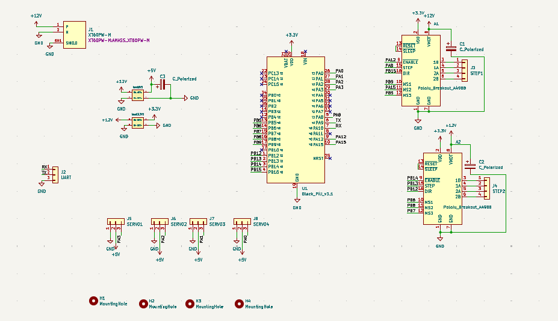
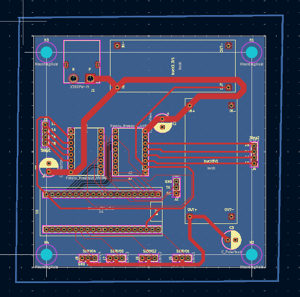
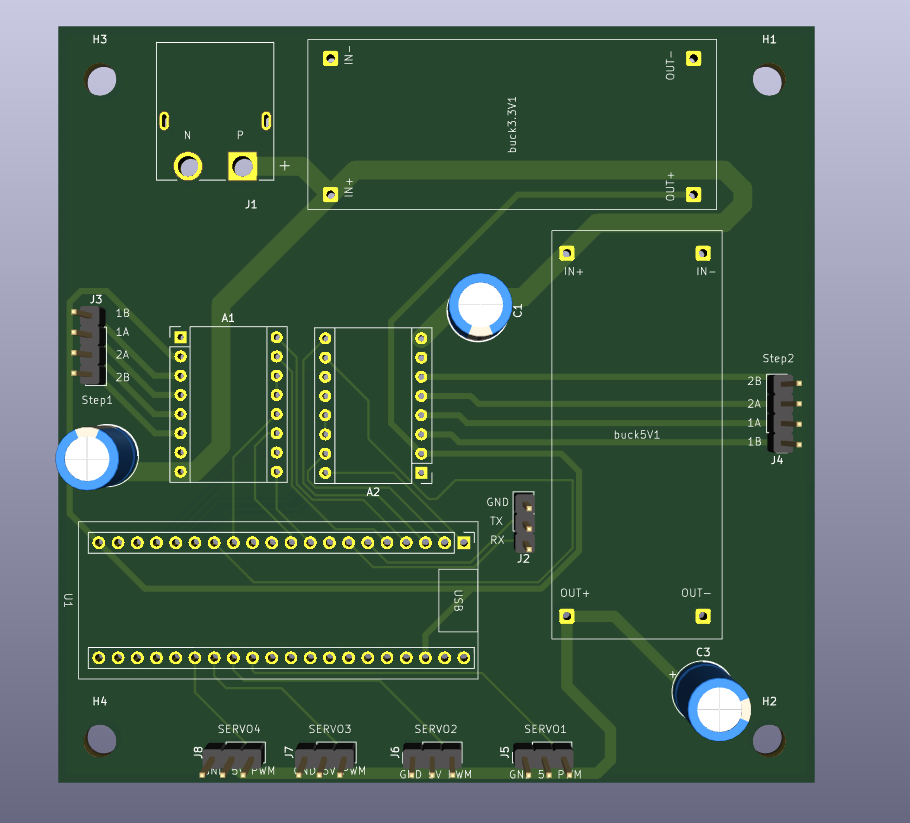

# 🚀 Contrôleur STM32 - 2x Moteurs Pas-à-Pas (A4988) & 4x Servomoteurs

Ce dépôt contient la conception matérielle complète (schématique et PCB 2 couches $100\text{ mm} \times 100\text{ mm}$) d'une carte de contrôle embarquée pour la robotique et l'automatisme. Elle est pilotée par une **STM32 Black Pill** et alimentée par une batterie **LiPo 3S (12V)**.

---

## 📸 Aperçu du Projet

### 1. Schéma Électrique

### 2. Routage PCB (Vue 2D)

### 3. Rendu 3D de la Carte

---

## ⚡ Architecture d'Alimentation : La stratégie des "Deux Bucks"

La carte accepte une tension d'entrée principale $12\text{ V}$ via un connecteur **XT60**. Pour garantir une stabilité maximale et isoler les bruits électromécaniques, nous avons fait le choix d'intégrer **deux convertisseurs Buck (DC-DC) distincts** :

### 1. Buck 3.3V (Logique & Microcontrôleur)
* **Rôle :** Alimentation stable du STM32 (broche `VDD`) et des entrées logiques des drivers A4988.
* **Intérêt :** Consommation faible et constante. L'isolation de ce rail protège le processeur contre les chutes de tension (*brownouts*).

### 2. Buck 5V (Puissance Servomoteurs)
* **Rôle :** Alimentation directe des 4 servomoteurs (`J5` à `J8`) et du rail `VIN` de secours.
* **Intérêt :** Absorbe les forts appels de courant et le bruit inductif (*Back-EMF*) générés par les moteurs des servos sans impacter la logique numérique du STM32.

---

## 🔋 Rôle et Placement des Condensateurs de Filtrage ($220\text{ µF}$)

Pour assurer la longévité des composants et la stabilité des tensions, des condensateurs électrolytiques de **$220\text{ µF}$** ont été intégrés aux emplacements stratégiques de la carte :

### 1. Condensateurs sur la ligne `VMOT` des A4988 ($220\text{ µF}$)
Placés au plus près de la broche d'alimentation haute tension (`VMOT`) de chaque driver pas-à-pas :
* **Protection contre les surtensions inductives (Back-EMF) :** Les bobines des moteurs pas-à-pas génèrent de violents pics de tension en retour lors des commutations rapides ou du freinage. Sans ces condensateurs de $220\text{ µF}$, ces transitoires peuvent dépasser la tension maximale tolérée par le A4988 ($35\text{ V}$) et détruire instantanément le driver.
* **Réservoir d'énergie local :** Ils fournissent l'énergie instantanée nécessaire au hachage PWM du courant dans les phases des moteurs, évitant que les pics de courant ne se propagent sur toute la ligne $12\text{ V}$.

### 2. Condensateur en sortie du Buck 5V ($220\text{ µF}$)
Placé immédiatement en sortie du convertisseur $5\text{ V}$ alimentant les servomoteurs :
* **Absorption des pics de démarrage (Inrush Current) :** Un servomoteur peut appeler plusieurs ampères pendant quelques millisecondes lorsqu'il démarre ou change brutalement de sens. Ce condensateur de $220\text{ µF}$ sert de réservoir d'énergie immédiat pour lisser ces appels de courant et éviter l'écroulement de la ligne $5\text{ V}$.
* **Filtrage de l'ondulation (Ripple) :** Il réduit le bruit haute fréquence issu du hachage interne du Buck $5\text{ V}$, garantissant un signal propre pour les servos et l'électronique annexe.

---

## 📐 Création des Empreintes Personnalisées (Custom Footprints)

Afin d'assurer un assemblage parfait et de respecter les dimensions compactes de la carte ($100\text{ mm} \times 100\text{ mm}$), plusieurs empreintes spécifiques ont été créées sur mesure dans une bibliothèque dédiée du projet (`.pretty`) :

* **Modules Buck DC-DC (`buck3.3V1` & `buck5V1`) :** Les modules abaisseurs génériques ne possédant pas de standard de perçage universel, leurs empreintes ont été modélisées manuellement (espacement exact des broches `IN+`, `IN-`, `OUT+`, `OUT-` et dimensions hors-tout) pour s'intégrer directement comme cartes filles.
* **STM32 Black Pill (`Black_Pill_v3.1`) :** Empreinte personnalisée assurant le pitch standard de $2.54\text{ mm}$ entre les rangées de broches et l'intégration exacte du connecteur USB-C.

---

## 🛠️ Contraintes de Fabrication & Règles de Routage (DRC)

Le routage de la carte a été validé sous KiCad avec zéro erreur DRC selon les règles de fabrication industrielles standard :

| Paramètre | Valeur Minimale Validée |
| :--- | :--- |
| **Largeur des pistes de signal** (`STEP`, `DIR`, `SERVO`) | `0.3 mm`  |
| **Largeur des pistes de puissance** (`+5V`, `+12V`, Moteurs) | `0.8 mm` à `2.5 mm` |
| **Isolement entre pistes (Clearance)** | `0.3 mm` |
| **Distance cuivre au bord de carte (Edge.Cuts)** | `0.5 mm` |
| **Plan de masse** | Plan continu sur couche inférieure (`B.Cu`) |

---

## ⚠️ Note Importante : Configuration de la broche PA15 (SWD)

Sur cette carte, la broche **`PA15`** du STM32 est reliée au signal `MS2` du premier driver A4988.

* **Mode de programmation :** Par défaut, `PA15` est réservée à la fonction de débogage JTAG. Pour l'utiliser comme une broche d'entrée/sortie classique (GPIO), la programmation du STM32 **doit impérativement être effectuée en mode SWD (Serial Wire Debug)** via ST-Link (`SWDIO` sur PA13, `SWCLK` sur PA14).
